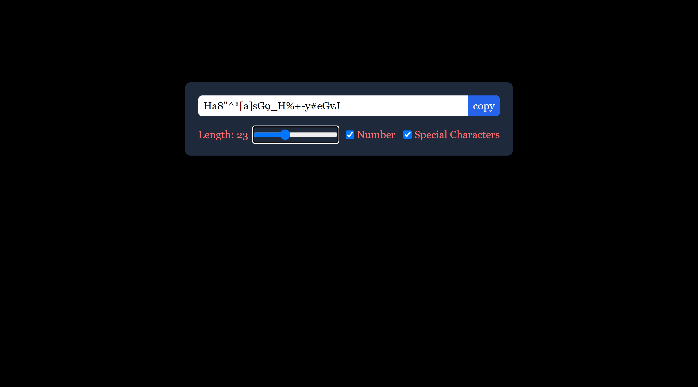

# Password Generator

It is a Beginner friendly react project.

Important steps to run this project in your personal computer follow the steps below --

Requirements:

> > [Node.js](https://nodejs.org/en)

Clone the repository:

```bash
git clone https://github.com/SayanBanerjee-007/React_Background_Changer.git
```

Go to ./00-react-source-code:

```bash
cd ./00-react-source-code
```

Installation of packages:

```bash
npm i
```

Goto the URL:

> > http://localhost:3000

## Preview


